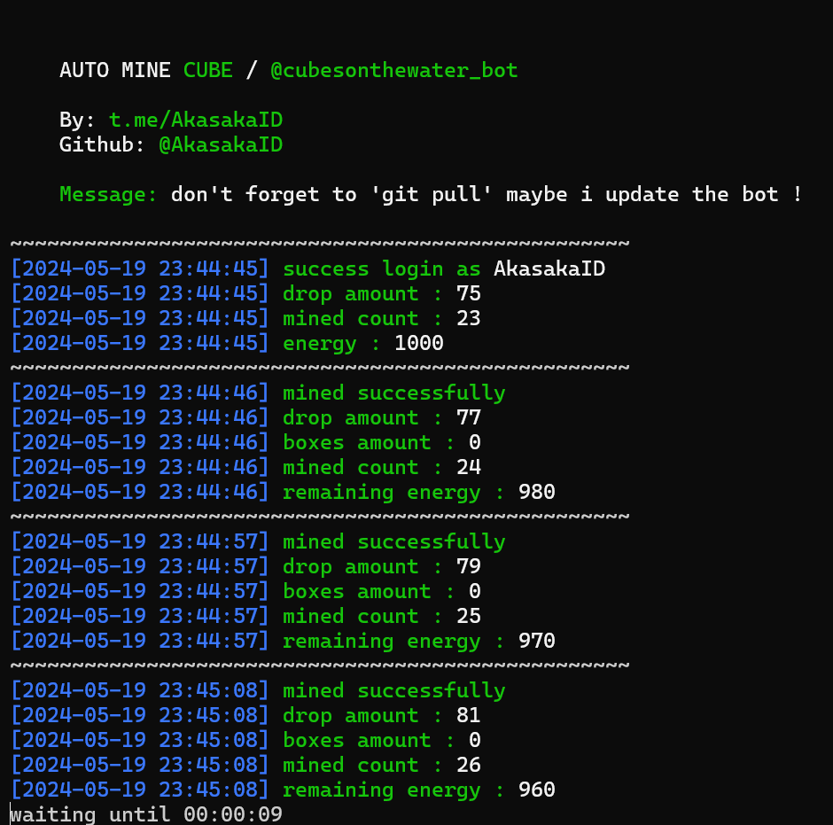

# cubetod

Auto mine for cubes bot 

<center>
    
</center>

## English README [HERE](README.md)

# Pendaftaran

Klik link dibawah untuk pendaftaran

[https://t.me/cubesonthewater_bot?start=NjI5NDM4MDc2](https://t.me/cubesonthewater_bot?start=NjI5NDM4MDc2)

# Cara penggunaan

1. Pastikan komputermu sudah terinstall python dan git.
2. Clone repository ini
   ```
   git clone https://github.com/akasakaid/cubetod.git
   ```
3. Masuk ke folder repository
   ```
   cd cubetod
   ```
4. Install library yang dibutuhkan
   ```
   python -m pip install -r requirements.txt
   ```
5. Ambil data akun, untuk ambil data akun kamu bisa mengikuti tutorial video berikut [https://youtu.be/VlUxMQ3xLQM](https://youtu.be/VlUxMQ3xLQM)
6. Jalankan bot.py
   ```
   python bot.py
   ```

# Penjelasan file config.json

| key        | description                                          |
| ---------- | ---------------------------------------------------- |
| interval   | durasi waktu tunggu disetiap request / mine          |
| min_energy | energi minimum untuk masuk ke mode sleep             |
| sleep      | durasi mode sleep / waktu tunggu ketika energi habis |

# Bagaimana cara mendapatkan data akun
Ikuti tutorial video berikut [https://youtu.be/VlUxMQ3xLQM](https://youtu.be/VlUxMQ3xLQM)

# Diskusi
Jika kamu ada pertanyaan, silahkan bertanya di sini [sdsproject_chat](https://t.me/sdsproject_chat)